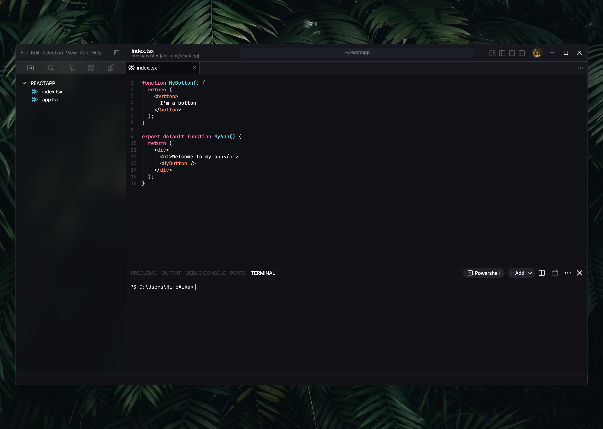

# MikoIDE

[](LICENSE)
[](#)
[](#)
[](#)
[](#)
[](#)



MikoIDE is a modern, lightweight IDE (Integrated Development Environment) built from scratch using cutting-edge web technologies and native C++ performance. It combines the flexibility of web-based UI with the power of native desktop applications.

## ✨ Key Features

- 📝 **Advanced Code Editor** - File editing with intelligent syntax highlighting
- 🔍 **Real-time Linting** - Instant feedback for syntax errors and code quality
- ▶️ **Code Execution** - Run code snippets directly within the IDE
- 🎨 **Customizable Layout** - Flexible workspace arrangement to suit your workflow
- 🔌 **Plugin System** - Extensible architecture with VS Code extension support
- 🌙 **Dark Theme** - Modern dark theme for comfortable coding sessions
- 🚀 **High Performance** - Native C++ backend with CEF for optimal performance
- 📁 **Project Management** - Integrated file explorer and project organization

## 🛠️ Technology Stack

### Frontend
- **React 19+** - Modern UI framework for responsive interfaces
- **TypeScript** - Type-safe development with enhanced IDE support
- **Vite** - Fast build tool and development server
- **TailwindCSS** - Utility-first CSS framework for styling

### Backend
- **C++17** - High-performance native backend
- **CEF (Chromium Embedded Framework)** - Web content rendering engine
- **CMake** - Cross-platform build system
- **SDL2** - Cross-platform development library

### Development Tools
- **Bun** - Fast JavaScript runtime and package manager
- **ESLint** - Code quality and style enforcement
- **Git** - Version control integration

## 🚀 Getting Started

### Prerequisites
- Windows 10/11, macOS 10.14+, or Linux (Ubuntu 18.04+)
- CMake 3.16 or higher
- Visual Studio 2019+ (Windows) or GCC 8+ (Linux) or Xcode 11+ (macOS)
- Node.js 21+ and Bun

### Installation

1. **Clone the repository**
   ```bash
   git clone https://github.com/arizkami/MikoIDE.git
   cd MikoIDE
   ```

2. **Install dependencies**
   ```bash
   bun install
   ```

3. **Build the project**
   ```bash
   mkdir build
   cd build
   cmake ..
   cmake --build . --config Release
   ```

4. **Run MikoIDE**
   ```bash
   ./MikoIDE
   ```

## 📁 Project Structure

```
MikoIDE/
├── app/                    # C++ application core
│   ├── core/              # Core application logic
│   ├── sandbox/           # Extension sandbox environment
│   └── main.cpp           # Application entry point
├── renderer/              # React frontend application
│   ├── src/               # React components and logic
│   └── public/            # Static assets
├── core/                  # TypeScript core modules
│   ├── editor/            # Editor functionality
│   └── lang/              # Language support
├── wrapper/               # VS Code extension wrapper
└── tools/                 # Development utilities
```

## 🎯 Roadmap

### Short Term (v1.1)
- [ ] Enhanced syntax highlighting for more languages
- [ ] Integrated terminal support
- [ ] Basic debugging capabilities
- [ ] Improved error handling and user feedback

### Medium Term (v1.5)
- [ ] Advanced debugging with breakpoints
- [ ] Git integration with visual diff
- [ ] Plugin marketplace
- [ ] Collaborative editing features

### Long Term (v2.0)
- [ ] Language Server Protocol (LSP) support
- [ ] Advanced refactoring tools
- [ ] Performance profiling integration
- [ ] Cloud synchronization
- [ ] Mobile companion app

## 🔌 Extension System

MikoIDE supports VS Code extensions through a custom sandbox environment:

- **Extension Storage**: Extensions are stored in `app/extensions/`
- **VSIX Support**: Install extensions directly from VSIX files
- **Sandbox Security**: Extensions run in a secure V8 sandbox
- **Native APIs**: Access to file system and IDE functionality

## 🤝 Contributing

We welcome contributions! Please see our [Contributing Guidelines](CONTRIBUTING.md) for details.

1. Fork the repository
2. Create a feature branch (`git checkout -b feature/amazing-feature`)
3. Commit your changes (`git commit -m 'Add amazing feature'`)
4. Push to the branch (`git push origin feature/amazing-feature`)
5. Open a Pull Request

## 📄 License

This project is licensed under the MIT License - see the [LICENSE](LICENSE) file for details.

## 🙏 Acknowledgments

- [CEF Project](https://bitbucket.org/chromiumembedded/cef) for the embedded browser framework
- [React Team](https://reactjs.org/) for the amazing UI library
- [VS Code](https://code.visualstudio.com/) for extension API inspiration
- All contributors who help make MikoIDE better
